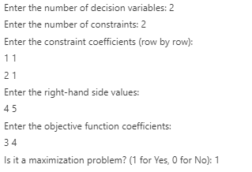

<-- Group 11 -->

**Matric No.** | **Fullname**
--- | ---
U22CS1093 | Nanpon Manfa Elias
U22CS1095 | Nwuba Richard Chukwudalu [Click Here](https://github.com/Cyberrickx/Group11SimplexProject)
U22CS1096 | Odiase Brian Ehimare [Click Here](https://github.com/Briankills1/Simplex-Algorithm-Project/issues/1)
U22CS1097 | Okewu Victoria Ochanya [Click Here](https://github.com/ochanyavictoria/Group-11-Simplex-Project-)
U22CS1098 | Oloruntoba Favour Oluwatosin [Click Here](https://github.com/Techy-fave/Group11SimplexProject)
U22CS1099 | Olukayode Divine Oladotun [Click Here](https://github.com/TheVine001/Group-11-Simplex-Project)
U22CS1100 | Omale Ojoajogwu Joseph [Click Here](https://github.com/mrjayboss0505/Group-11-Simplex-Project-)
U22CS1103 | Oluwaseyi Adeniyi Oyekunle [Click Here](https://github.com/Deniyhi/Group11SimplexProject)
U22CS1119 | Yakubu Zaniab Ohunene [Click Here](https://github.com/zaynabohunene/Group-11-simplex-project.git)

---
**Name**: Oloruntoba Favour Oluwatosin </br>
**Matric no.**: U22CS1098 </br>

# **C++ Implementation of the Simplex Algorithm for Solving Linear Programming Problems (LPPs)**

---

## Table of Contents
1. [Description](#description)
2. [Features](#features)
3. [System Requirements](#system-requirements)
4. [Code Structure](#code-structure)
5. [How It Works](#how-it-works)
6. [User Interaction](#user-interaction)
7. [Example and Output](#example-and-output)
8. [Conclusion](#conclusion)

---

## Description
This project implements the **Simplex Algorithm** in C++ to solve Linear Programming Problems (LPPs). It supports problems with "less than or equal to" constraints and nonnegative right-hand side values. The program handles both maximization and minimization problems and provides detailed output of the Simplex tableau at each iteration for educational purposes.

---

## Features
- Supports both maximization and minimization problems.
- Displays the Simplex tableau at each iteration.
- Provides a step-by-step solution for better understanding.
- Easy-to-use command-line interface.

---

## System Requirements
### Hardware Requirements
- **Processor**: Intel Core i3 or equivalent (minimum)
- **RAM**: 4 GB (minimum)
- **Storage**: 100 MB of free disk space
- **Operating System**: Windows, macOS, or Linux

### Software Requirements
- **Compiler**: C++ compiler (e.g., GCC, Clang, or MSVC)
- **IDE**: Any C++ compatible IDE (e.g., Visual Studio Code, Code::Blocks, or Xcode)
- **Libraries**: Standard C++ libraries (no external dependencies required)

---

## Code Structure
The program is structured into a single C++ class (`Simplex`) and a `main` function. The `Simplex` class contains methods to initialize the tableau, compute \( C_j - Z_j \) values, find pivot columns and rows, perform pivot operations, and solve the LPP.

Below is a breakdown of the code structure:

### Class: `Simplex`
The `Simplex` class encapsulates the logic for solving Linear Programming Problems using the Simplex Algorithm. It contains the following key components:

#### Attributes
- `numVariables`: Number of decision variables in the LPP.
- `numConstraints`: Number of constraints in the LPP.
- `tableau`: A 2D vector representing the Simplex tableau.
- `basicVariables`: A vector storing the indices of basic variables.
- `isMaximization`: A boolean flag indicating whether the problem is a maximization or minimization problem.

#### Methods
1. **`initializeTableau`**:
   - Initializes the Simplex tableau using the constraint coefficients, right-hand side values, and objective function coefficients.
   - Adds slack variables to convert inequalities into equalities.

2. **`printTableau`**:
   - Displays the current state of the Simplex tableau in a formatted manner.

3. **`computeCjZj`**:
   - Computes the \( C_j - Z_j \) values for non-basic variables to determine the entering variable.

4. **`findPivotColumn`**:
   - Identifies the pivot column (entering variable) based on the \( C_j - Z_j \) values.

5. **`findPivotRow`**:
   - Identifies the pivot row (leaving variable) using the minimum ratio test.

6. **`pivot`**:
   - Performs the pivot operation to update the tableau and basic variables.

7. **`solve`**:
   - Implements the Simplex Algorithm by iteratively performing pivot operations until an optimal solution is found or the problem is determined to be unbounded.

### Main Function
The `main` function handles user interaction, collects input data, and invokes the `Simplex` class to solve the problem.

---


## How It Works
1. **Input Collection**: The user provides the number of decision variables, constraints, constraint coefficients, right-hand side values, and objective function coefficients.
2. **Tableau Initialization**: The program constructs the initial Simplex tableau.
3. **Simplex Iterations**: The program iteratively performs pivot operations until an optimal solution is found or the problem is determined to be unbounded.
4. **Output**: The program displays the optimal solution, including the values of decision variables and the objective function.

---

## 4. Procedure for User Interaction

### Step-by-Step Guide
1. **Compile the Program**:
   - Use a C++ compiler to compile the program. For example:
     ```bash
     g++ simplex.cpp -o simplex
     ```

2. **Run the Program**:
   - Execute the compiled program:
     ```bash
     ./simplex
     ```

3. **Provide Input**:
   - Enter the following details when prompted:
     - Number of decision variables.
     - Number of constraints.
     - Coefficients of the constraints (row by row).
     - Right-hand side values of the constraints.
     - Coefficients of the objective function.
     - Type of problem (1 for maximization, 0 for minimization).

4. **View Output**:
   - The program will display the Simplex tableau at each iteration and the final optimal solution.

---

## 5. Example and Expected Output

### Example Problem
Consider the following Linear Programming Problem:

**Maximize**:
\[
Z = 3x_1 + 4x_2
\]

**Subject to**:
\[
x_1 + x_2 \leq 4
\]
\[
2x_1 + x_2 \leq 5
\]
\[
x_1, x_2 \geq 0
\]

### Input



### Output


---

## 6. Conclusion

The Simplex Algorithm is a powerful tool for solving Linear Programming Problems (LPPs). This implementation provides a clear and structured approach to solving LPPs with "less than or equal to" constraints and nonnegative right-hand side values. By systematically transforming constraints into a structured tableau and iteratively improving the solution, the algorithm ensures optimality in decision-making scenarios.

The program successfully solves LP problems through systematic pivoting and iterative optimization, demonstrating the efficiency of the Simplex method in real-world applications. The C++ implementation presented in this project highlights the practical application of the Simplex method in computational problem-solving.

While the Simplex Algorithm is efficient for many real-world problems, it has limitations, such as its performance on very large datasets or cases involving degeneracy. Despite these challenges, it remains a powerful and reliable tool for linear optimization.


## Files in the Repository
- `simplex.cpp` – Main C++ implementation of the Simplex Algorithm.
- `README.md` – Documentation and usage guide.

## License
This project is open-source and available under the **MIT License**.
---

**End of README**